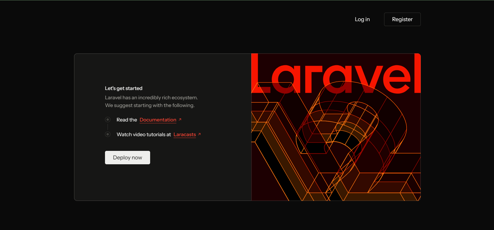

# Coffee Break By: Maus Foodhouse atbp.
### Responsive Product Landing Page
**ITST 302 – Client-Server Technologies | Week 5 Mini Project**

---

## 1. Project Title

**Coffee Break By: Maus Foodhouse atbp. – Responsive Product Landing Page**

Built with **Laravel**, **Tailwind CSS v4**, and **Blade Components**.

---

## 2. Introduction

### What is a Product Landing Page?

A product landing page is a focused web page designed to introduce, promote, or sell a specific product or service. Unlike a full website, a landing page has a single goal: to capture the visitor's attention and guide them toward a clear action — whether that's making a purchase, signing up, or contacting the business.

### Why Are Landing Pages Important for Businesses?

In today's digital-first world, most customers discover businesses online before ever visiting in person. A well-designed landing page:

- Creates a **strong first impression** that reflects the brand's identity
- Provides **all essential information** in one place (menu, prices, location, contact)
- Increases **customer trust** through professional presentation
- Works on **any device** — mobile, tablet, or desktop — reaching more customers
- Enables small businesses to **compete professionally** online without complex systems

For a local business like Coffee Break By: Maus Foodhouse atbp. in Magdalena, Laguna, having an online presence through a well-crafted landing page can significantly increase visibility, attract new customers, and improve customer experience.

### Purpose of This Project

This project was developed as part of ITST 302 – Client-Server Technologies, Week 5 laboratory activity. The goal was to design and develop a modern, responsive product landing page for a real local business using **Laravel Blade Components** and **Tailwind CSS**, following component-based frontend architecture principles.

The chosen business is **Coffee Break By: Maus Foodhouse atbp.**, a food and beverage shop located at the Plaza of Magdalena, Laguna, offering affordable coffee, milk tea, milkshakes, rice meals, burgers, and more.

---

## 3. Objectives

Upon completing this activity, the following learning objectives were accomplished:

1. ✅ Built responsive interfaces using **Tailwind CSS v4** utility classes
2. ✅ Created reusable **Laravel Blade Components** to eliminate duplicated code
3. ✅ Applied responsive design principles for **desktop, tablet, and mobile** layouts
4. ✅ Organized frontend components following **Laravel best practices**
5. ✅ Implemented consistent UI design using **typography, spacing, colors, and layouts**
6. ✅ Documented frontend architecture and component design in **README.md**
7. ✅ Published the project through **GitHub** for portfolio use

---

## 4. Responsive Web Design

### Mobile-First Design

This project follows a **mobile-first approach**, which means the base styles are written for small screens first, and larger layouts are added using responsive breakpoints. This ensures the page is usable and visually appealing on smartphones before being enhanced for bigger screens.

Example from `hero.blade.php`:
```html
<h1 class="text-4xl sm:text-5xl lg:text-6xl font-extrabold text-gray-900">
    Good Food. Great Drinks. Perfect Break.
</h1>
```
The heading starts at `text-4xl` on mobile, scales to `text-5xl` on small screens, and `text-6xl` on large screens.

### Responsive Breakpoints

Tailwind CSS v4 uses the following breakpoints used throughout this project:

| Prefix | Minimum Width | Typical Device |
|--------|--------------|----------------|
| _(none)_ | 0px | Mobile (default) |
| `sm:` | 640px | Large mobile / Small tablet |
| `md:` | 768px | Tablet |
| `lg:` | 1024px | Laptop / Small desktop |
| `xl:` | 1280px | Desktop |

### Flexbox

Flexbox is used for alignment and horizontal/vertical layouts throughout the project. Key usage:

- **Navbar:** `flex items-center justify-between` — aligns logo, nav links, and buttons
- **Hero buttons:** `flex flex-col sm:flex-row gap-4` — stacks vertically on mobile, horizontal on larger screens
- **Footer columns:** `flex flex-col gap-3` — stacks list items vertically

### CSS Grid

CSS Grid is used for multi-column section layouts:

- **Features:** `grid sm:grid-cols-2 lg:grid-cols-3` — 1 col → 2 cols → 3 cols
- **Menu (Product Showcase):** `grid sm:grid-cols-2 lg:grid-cols-4` — up to 4 columns on desktop
- **Pricing:** `grid md:grid-cols-3` — 3 equal pricing cards on tablet and above
- **Footer:** `grid sm:grid-cols-2 lg:grid-cols-4` — 4 columns on wide screens

### User Experience (UX)

Responsive design is critical for user experience because:

- Over **60% of web traffic** comes from mobile devices
- Users abandon sites that are hard to navigate on their phone
- Google uses **mobile-first indexing**, meaning mobile-friendly sites rank better in search results
- Consistent layouts across devices build **user trust** in the brand

This project tested responsiveness using **Chrome DevTools** device simulator at 375px (mobile), 768px (tablet), and 1440px (desktop).

---

## 5. Tailwind CSS

### Utility-First CSS

Tailwind CSS is a **utility-first CSS framework**, meaning instead of writing custom CSS classes, you compose designs directly in HTML using small, single-purpose utility classes.

Traditional CSS approach:
```css
.hero-title {
    font-size: 3rem;
    font-weight: 800;
    color: #111827;
    line-height: 1.2;
}
```

Tailwind approach used in this project:
```html
<h1 class="text-5xl font-extrabold text-gray-900 leading-tight">
```

### Advantages of Tailwind CSS

1. **No context switching** — styles are written directly in HTML
2. **No naming fatigue** — no need to invent class names like `.hero-title-wrapper`
3. **Responsive by default** — every utility has responsive prefixes (`sm:`, `md:`, `lg:`)
4. **Consistent design system** — built-in spacing, color, and typography scales
5. **Small production bundle** — only used classes are included in the final CSS

### Responsive Utility Classes

This project uses responsive prefixes on nearly every layout class:

```html
<!-- Features grid: 1 col on mobile, 2 on sm, 3 on lg -->
<div class="grid sm:grid-cols-2 lg:grid-cols-3 gap-5 sm:gap-6">

<!-- Padding that grows with screen size -->
<div class="px-4 sm:px-6 lg:px-8">

<!-- Image height that scales up -->

```

### Component Styling

Key Tailwind patterns used in components:

| Pattern | Classes Used | Purpose |
|---------|-------------|---------|
| Card | `rounded-2xl shadow-md hover:shadow-xl transition` | Elevated card with hover lift |
| Primary Button | `bg-orange-500 text-white rounded-full hover:bg-orange-600` | Brand-colored CTA |
| Section Badge | `text-orange-500 font-semibold uppercase tracking-wider text-sm` | Section label |
| Avatar | `w-12 h-12 rounded-full bg-orange-100 flex items-center justify-center` | Initial-based avatar |

---

## 6. Blade Components

### What Are Blade Components?

Blade Components are reusable HTML building blocks in Laravel's templating engine. Instead of copying and pasting the same HTML structure across multiple views, a component is defined once and reused anywhere with a clean, tag-like syntax.

### Why Reusable Components Improve Maintainability

Without components, changing the button style across a landing page would require updating every instance manually. With components, you update **one file** and the change propagates everywhere.

**Before (without components):**
```html
<!-- page1.blade.php -->
<a href="#menu" class="px-7 py-3.5 bg-orange-500 text-white font-semibold rounded-full hover:bg-orange-600 shadow-lg">
    View Our Menu
</a>

<!-- page2.blade.php — duplicate! -->
<a href="#contact" class="px-7 py-3.5 bg-orange-500 text-white font-semibold rounded-full hover:bg-orange-600 shadow-lg">
    Contact Us
</a>
```

**After (with Blade components):**
```blade
{{-- button.blade.php defines it once --}}
<x-button href="#menu">View Our Menu</x-button>
<x-button href="#contact" variant="secondary">Contact Us</x-button>
```

### Benefits of Modular UI Development

1. **Single Source of Truth** — change one file, all instances update
2. **Consistency** — every card, button, and section looks the same throughout the page
3. **Readability** — `<x-feature-card icon="☕" title="Fresh Coffee" />` is self-documenting
4. **Scalability** — adding a new pricing plan is one line, not 20 lines of HTML
5. **Separation of Concerns** — each component is responsible for its own markup

### Components Built in This Project

```
resources/views/components/
├── navbar.blade.php          Navigation bar with mobile menu
├── hero.blade.php            Hero section with CTA buttons
├── features.blade.php        Features section container
├── feature-card.blade.php    Reusable feature card (icon, title, desc)
├── menu.blade.php            Product showcase / menu section
├── pricing.blade.php         Pricing section container
├── pricing-card.blade.php    Reusable pricing card (name, price, features)
├── testimonials.blade.php    Testimonials section container
├── testimonial-card.blade.php Reusable testimonial card (name, role, message)
├── cta.blade.php             Call-to-action section
├── button.blade.php          Reusable button with variant support
└── footer.blade.php          Site footer
```

### Sample: `feature-card.blade.php`

```blade
<div class="bg-white rounded-2xl p-5 sm:p-6 shadow-md hover:shadow-xl
            transition duration-300 border border-gray-100">
    <div class="w-14 h-14 rounded-2xl bg-orange-100
                flex items-center justify-center text-3xl mb-5">
        {{ $icon }}
    </div>
    <h3 class="text-lg sm:text-xl font-bold text-gray-900 mb-3">
        {{ $title }}
    </h3>
    <p class="text-gray-600 leading-relaxed text-sm sm:text-base">
        {{ $description }}
    </p>
</div>
```

**Usage:**
```blade
<x-feature-card
    icon="☕"
    title="Freshly Prepared Drinks"
    description="Enjoy delicious coffee prepared fresh for every order."
/>
```

### Sample: `button.blade.php` (with variants)

```blade
@props(['href' => '#', 'variant' => 'primary'])

@php
    $variantClasses = match ($variant) {
        'secondary' => 'border-2 border-orange-500 text-orange-600 hover:bg-orange-500 hover:text-white',
        'white'     => 'bg-white text-orange-600 hover:bg-orange-50 shadow-lg',
        default     => 'bg-orange-500 text-white hover:bg-orange-600 shadow-lg',
    };
@endphp

<a href="{{ $href }}" {{ $attributes->merge(['class' => 'inline-block px-7 py-3.5 font-semibold rounded-full transition duration-300 ' . $variantClasses]) }}>
    {{ $slot }}
</a>
```

---

## 7. User Interface Design

### Color Palette

| Color | Hex | Usage |
|-------|-----|-------|
| Orange 500 | `#f97316` | Primary brand color — buttons, accents, badges |
| Orange 600 | `#ea580c` | Button hover state |
| Orange 50 | `#fff7ed` | Warm section backgrounds (hero, testimonials) |
| Orange 100 | `#ffedd5` | Feature icon backgrounds, avatar backgrounds |
| Gray 900 | `#111827` | Page headings, footer background |
| Gray 700 | `#374151` | Navbar links |
| Gray 600 | `#4b5563` | Body text, descriptions |
| Gray 100 | `#f3f4f6` | Card hover borders |
| White | `#ffffff` | Cards, navbar background |
| Yellow 400 | `#facc15` | Star ratings in testimonials |

The warm orange palette was chosen to reflect the cozy, welcoming atmosphere of a coffee shop and food business — energetic and inviting without being overwhelming.

### Typography

| Element | Tailwind Classes | Size |
|---------|-----------------|------|
| Hero Heading | `text-4xl sm:text-5xl lg:text-6xl font-extrabold` | 36px – 60px |
| Section Heading | `text-3xl sm:text-4xl font-extrabold` | 30px – 36px |
| Card Heading | `text-lg sm:text-xl font-bold` | 18px – 20px |
| Body Text | `text-sm sm:text-base text-gray-600` | 14px – 16px |
| Badges | `text-sm font-semibold uppercase tracking-wider` | 14px |
| Price | `text-4xl font-extrabold text-gray-900` | 36px |

The font stack uses the browser default (`Arial, Helvetica, sans-serif`) for readability across all devices.

### Iconography

Emoji icons were used throughout the project for visual appeal without requiring an icon library:

- ☕ Coffee | 🧋 Milk Tea | 🍔 Burger | 🍚 Rice | 🍟 Fries | 🥤 Milkshake | 🌭 Hotdog | 🍓 FruiTea
- ✓ Checkmark (pricing features) | ★ Stars (testimonial rating) | 📍 Location | 🕙 Hours | 📞 Phone

### Button Styles

Three button variants were implemented via the `<x-button>` component:

1. **Primary:** `bg-orange-500 text-white hover:bg-orange-600` — main CTA actions
2. **Secondary:** `border-2 border-orange-500 text-orange-600 hover:bg-orange-500 hover:text-white` — alternative actions
3. **White:** `bg-white text-orange-600 hover:bg-orange-50` — used on the orange CTA section background

### Card Design

Cards follow a consistent pattern:
- `rounded-2xl` — modern, friendly rounded corners
- `shadow-md` default + `hover:shadow-xl` — subtle elevation on hover
- `border border-gray-100` — light border for definition on white backgrounds
- `transition duration-300` — smooth hover animation

### Layout Consistency

- **Max width:** All sections use `max-w-7xl mx-auto` to center content with consistent margins
- **Padding:** `px-4 sm:px-6 lg:px-8` — consistent horizontal padding across all sections
- **Vertical rhythm:** `py-16 sm:py-20` — consistent section spacing
- **Section headers:** Every section uses the same label → heading → description pattern

These design choices ensure the page feels cohesive and professional, improving user trust and readability.

---

## 8. Folder Structure

```
week05-product-landing-page/
│
├── app/                          Laravel application logic
│   ├── Http/Controllers/         Route controllers
│   ├── Models/                   Eloquent models
│   └── Providers/                Service providers
│
├── resources/
│   ├── views/
│   │   ├── layouts/
│   │   │   └── app.blade.php     Main layout (head, @vite, @yield)
│   │   ├── components/           Reusable Blade Components
│   │   │   ├── navbar.blade.php
│   │   │   ├── hero.blade.php
│   │   │   ├── feature-card.blade.php
│   │   │   ├── features.blade.php
│   │   │   ├── menu.blade.php
│   │   │   ├── pricing-card.blade.php
│   │   │   ├── pricing.blade.php
│   │   │   ├── testimonial-card.blade.php
│   │   │   ├── testimonials.blade.php
│   │   │   ├── cta.blade.php
│   │   │   ├── button.blade.php
│   │   │   └── footer.blade.php
│   │   └── pages/
│   │       └── home.blade.php    Home page (uses all components)
│   ├── css/
│   │   └── app.css               Global styles + Tailwind import
│   └── js/
│       ├── app.js                Mobile menu JavaScript
│       └── bootstrap.js          Axios setup
│
├── public/
│   ├── build/                    Compiled Vite assets (CSS + JS)
│   └── images/
│       └── storefront.jpg        Coffee Break storefront photo
│
├── routes/
│   └── web.php                   Route definitions
│
├── screenshots/                  Project screenshots for submission
│   └── README.md
│
├── documentation/                Before/after comparison and docs
│   └── README.md
│
├── vite.config.js                Vite + Laravel + Tailwind v4 config
├── package.json                  Node dependencies
└── README.md                     This file
```

### Purpose of Each Folder

| Folder | Purpose |
|--------|---------|
| `resources/views/layouts` | Contains `app.blade.php` — the master layout that all pages extend. Includes `<head>`, Vite asset loading, and `@yield('content')`. |
| `resources/views/components` | All reusable Blade Components. Each file is one self-contained UI element that can be used with `<x-component-name />` syntax. |
| `resources/views/pages` | Actual page views. `home.blade.php` extends the layout and assembles all components in order. |
| `public` | Web-accessible files. Contains compiled CSS/JS in `public/build/` and static images in `public/images/`. |
| `screenshots` | Contains screenshots of the finished landing page for documentation and portfolio purposes. |
| `documentation` | Contains before-and-after comparisons and detailed UI documentation. |

---

## 9. Screenshots

> **Note:** Screenshots were captured using Chrome DevTools at standard breakpoints.

### Desktop View (1440px)


### Tablet View (768px)


### Mobile View (375px)


### Navigation Bar


### Hero Section


### Features Section


### Product Showcase / Menu Section


### Pricing Section


### Testimonials Section


### Footer


### Blade Components Folder


### GitHub Repository


---

## 10. Before & After

### Before
The project started as a default Laravel installation with no custom views or styling. All sections were planned as wireframe sketches showing the intended layout.



### After
The finished landing page is a fully responsive, visually polished product page with consistent branding, component-based architecture, and smooth interactions.


See the `documentation/` folder for detailed before-and-after comparison images.

---

## 11. Getting Started

### Prerequisites

- PHP 8.2+
- Composer
- Node.js 20+
- XAMPP or Laravel Herd

### Installation

```bash
# Clone the repository
git clone https://github.com/YOUR_USERNAME/week05-product-landing-page.git
cd week05-product-landing-page

# Install PHP dependencies
composer install

# Install Node dependencies
npm install

# Copy environment file
cp .env.example .env
php artisan key:generate

# Build assets
npm run build

# Start the server
php artisan serve
```

Then open [http://localhost:8000](http://localhost:8000) in your browser.

---

## 12. Technology Stack

| Technology | Version | Purpose |
|-----------|---------|---------|
| Laravel | 12.x | PHP web framework |
| Tailwind CSS | 4.x | Utility-first CSS framework |
| Vite | 7.x | Frontend build tool |
| Laravel Vite Plugin | 2.x | Vite + Laravel integration |
| @tailwindcss/vite | 4.x | Tailwind v4 Vite plugin |
| Blade | (built-in) | Laravel templating engine |

---

## 13. Sections Implemented

| Section | Component | Status |
|---------|-----------|--------|
| Navigation Bar | `navbar.blade.php` | ✅ Complete |
| Hero Section | `hero.blade.php` | ✅ Complete |
| Features Section | `features.blade.php` + `feature-card.blade.php` | ✅ Complete (6 features) |
| Product Showcase | `menu.blade.php` | ✅ Complete (8 menu items) |
| Pricing Section | `pricing.blade.php` + `pricing-card.blade.php` | ✅ Complete (3 plans) |
| Testimonials | `testimonials.blade.php` + `testimonial-card.blade.php` | ✅ Complete (3 reviews) |
| Call-to-Action | `cta.blade.php` | ✅ Complete |
| Footer | `footer.blade.php` | ✅ Complete |

---

## 14. License

This project was created for academic purposes as part of ITST 302 – Client-Server Technologies.

© 2026 Coffee Break By: Maus Foodhouse atbp.
